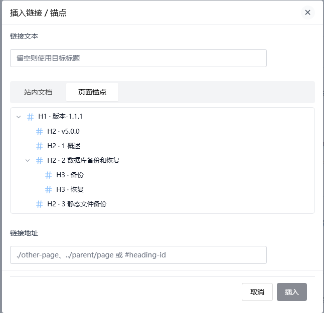
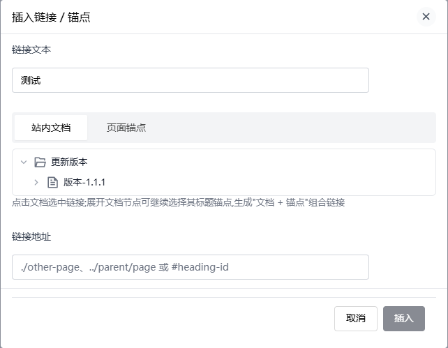

# 链接与锚点(halo-editor-probe)

为 Halo 默认编辑器提供增强的插入链接功能的插件,尤其适合配合 [Docsme 文档管理](https://www.halo.run/store/apps/app-yffxw)编写项目文档。

## 功能特性

- **站内文档链接**:在 Docsme 文档编辑页中,通过可收缩的文档树选择目标文档或目录,自动生成 `./install`、`../faq` 形式的相对链接——文档新增版本、切换语言、调整目录结构时链接依然有效
- **文档 + 锚点组合链接**:展开文档节点即可查看该文档的标题锚点,生成 `./install#下载` 形式的组合链接
- **页内锚点**:列出当前文档的标题层级树,一键生成 `#heading-id` 锚点链接(利用编辑器自动维护的标题 id)
- **通用超链接**:在文章、页面等其他编辑场景中,为选中文字挂载完整 URL
- **双入口**:顶部工具栏按钮和划词悬浮菜单均可唤起

## 截图

<!-- 上架前请替换为实际截图,建议包含:文档树选择、锚点选择、划词悬浮菜单入口 -->

| 插入链接弹窗 | 文档树与锚点 |
| --- | --- |
|  |  |

## 使用方法

1. 安装并启用本插件,无需额外配置
2. 在编辑器中选中文字(或不选),点击工具栏的链接按钮,或选中文字后在悬浮菜单中点击链接按钮
3. 在弹窗中:
   - **Docsme 文档编辑页**:在「站内文档」页签的文档树中选择目标文档/目录/锚点,链接地址自动生成;「页面锚点」页签可选择当前文档的标题
   - **其他编辑场景**:直接输入完整链接地址,或从标题树中选择页内锚点
4. 链接文本留空时自动使用目标文档/锚点标题

## 与 Docsme 的兼容性说明

Docsme 的文档编辑器对第三方编辑器扩展采用白名单机制。本插件在 Docsme 文档编辑页中生效需要 Docsme 将本插件(`halo-editor-probe`)加入白名单;已向 Docsme 作者提交该需求。在 Halo 自带的文章/页面编辑器中不受此限制,开箱即用。

> Docsme 是独立的第三方应用,其部分功能需要 Halo 专业版/商城版授权,相关授权与费用由 Docsme 决定,与本插件无关。本插件完全免费,且不依赖 Docsme 即可在 Halo 自带编辑器中使用。

## 隐私说明

本插件不收集、存储、上传或共享任何用户数据。所有网络请求仅访问当前站点的 REST API(读取文档树与文档内容用于生成链接),不向任何第三方服务发送数据,不包含遥测、统计或追踪。

## 第三方资源

- 图标来自 [Lucide](https://lucide.dev)(ISC 许可)与 [Remix Icon](https://remixicon.com)(Apache-2.0 许可),经 unplugin-icons 按需打包
- Logo 为作者自制

## 环境要求

- Halo >= 2.26.0

## 开发

```bash
# 后端测试 + 前端检查 + 打包
./gradlew clean build

# 前端单元测试
cd ui && pnpm test:unit
```

插件 JAR 输出在 `build/libs` 目录。

## 许可证

[GPL-3.0](./LICENSE)

## 反馈

如有问题或建议,欢迎到 [GitHub Issues](https://github.com/baiuu/plugin-halo-editor-probe/issues) 反馈。
